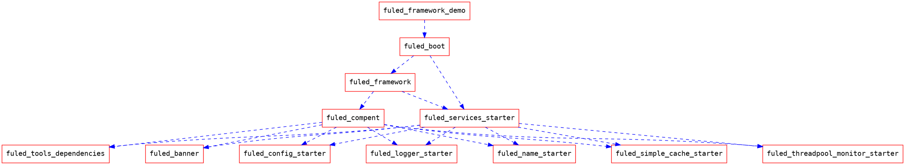

## Fuled-Framework 框架介绍

### 项目简介

#### 版本选择

版本的选择没有很新也没有较旧，选择中等偏高版本
|Spring Cloud Version|Spring Cloud Alibaba Version|Spring Boot Version|
|--|--|--|
|Spring Cloud Hoxton.SR9|2.2.6.RELEASE|2.3.2.RELEASE|

[版本对应关系](https://https://github.com/alibaba/spring-cloud-alibaba/wiki/%E7%89%88%E6%9C%AC%E8%AF%B4%E6%98%8E)

#### 功能介绍

框架主要解决一下问题

 - 统一依赖标准及版本，保持构建的项目结构及依赖一致
 - 整合常用中间件，统一中间件的接入方式
 - 减少项目搭建过程中的重复工作
 - 整合已知的最佳实践，避免踩同样的坑

#### 演示地址
nacos：http://prd.nacos.fuled.xyz:8848/nacos/
nacos：fuled/fuxiuzhan
nuxes:http://nexus.fuled.xyz:8081/repository/maven_2rd/

### 项目依赖结构

结构类似于如下，先凑合着看，总结的结构为fuled-framework-demo->fuled-boot->fuled-services-starter->fuled-compent-XXX->fuled-compent->fuled-framework

#### 
图无法显示可参考：
https://markdown.fuled.xyz:8443/s/0PNYqTOPl


### 各模块介绍

#### fuled-framework

```tex=
整个项目的父依赖，管理SpringCloud，SpringBoot,SpringCloudAlibaba的主体依赖
```

#### fuled-compent

```tex=
二方包的主要实现工程，包括注册中心，配置中心，全链路监控，常见中间件以最佳实践方式整合等
```

##### fuled-banner

```tex=

负责项目启动时打印logo：

___________    .__             .___
\_   _____/_ __|  |   ____   __| _/
 |    __)|  |  \  | _/ __ \ / __ |
 |     \ |  |  /  |_\  ___// /_/ |
 \___  / |____/|____/\___  >____ |
     \/                  \/     \/
```
##### fuled-config-starter
```tex=
整个项目比较复杂的点，本项目的config组件名称命名为DimaondConfigServer，是比较完善的动态配置组件

可以实现配置文件的自动配置及动态更新。可以做到本地无需指定配置文件，
项目启动时使用 java -Denv=[dev,test,pre,prd] -jar XXX.jar 启动即可

配置中心核心使用nacos实现，在项目启动时查下配置并注入系统变量中，扫描spring的注解和DimaondConfigChangeListenr注解，将这些bean与key进行绑定，当配置发生变更时，动态的通过反射进行更新。


```
##### fuled-logger-starter
```text
日志组件，可以扩展发送接口，将注解的接口的执行情况发送到服务端。也可以扩展cat日志，用于应用监控

```

##### fuled-name-starter
```text

注册中心，使用nacos实现，使用官方的discovery-starter，重新部分类和自动配置来实现参数的改写和将感兴趣的信息放在meta中上报注册中心，如系统的信息，应用的各个组件的版本，可通过meta信息进行应用版本等的监控和筛选

```
##### fuled-simple-cache-starter

```text

缓存组件，功能类似于spring-cache，但实现更简单，可控制每个key的过期时间，避免缓存雪崩问题

```
##### fuled-threadpool-monitor-starter
```text
计划实现线程池的监控预警和动态配置组件

```
##### fuled-tools-dependencies

```text
可集成常用组件的依赖
```

#### fuled-services-starter
```text
将compent中实现的各个组件进行整合依赖，其实正常情况下只引入此依赖即可实现框架功能，
但一般不直接这样使用，比如你可以直接引入springboot的依赖把项目编程springboot项目，但更多的时候是使用父依赖的方式来实现
```
```javascript=

/**
 * @author fxz
 */
@Target({ElementType.TYPE})
@Retention(RetentionPolicy.RUNTIME)
@Inherited
@Documented
@SpringBootApplication(exclude = {NacosDiscoveryAutoConfiguration.class, NacosServiceRegistryAutoConfiguration.class})
@EnableSimpleCache
@EnableDimaondConfig
public @interface EnableFuledBoot {
}
```
#### fuled-boot

```text

这个框架对外暴露的项目，作用类似于spring-boot-starter-parent
也会做一些其他工作，比如排除一些自动配置

```

```java=

```
#### fuled-framework-demo
```text
fuled-framework框架的示例项目，主要看pom文件
```
```xml=
<?xml version="1.0" encoding="UTF-8"?>
<project xmlns="http://maven.apache.org/POM/4.0.0" xmlns:xsi="http://www.w3.org/2001/XMLSchema-instance"
         xsi:schemaLocation="http://maven.apache.org/POM/4.0.0 https://maven.apache.org/xsd/maven-4.0.0.xsd">
    <modelVersion>4.0.0</modelVersion>
    <parent>
        <groupId>com.fxz</groupId>
        <artifactId>fuled-boot</artifactId>
        <version>1.0.0.WaterDrop</version>
    </parent>
    <groupId>com.fxz.monitor</groupId>
    <artifactId>server</artifactId>
    <version>1.0.0</version>
    <name>monitor-server</name>
    <description>Demo project for Spring Boot</description>
    <properties>
        <java.version>1.8</java.version>
    </properties>
    <dependencies>
        <dependency>
            <groupId>org.springframework.boot</groupId>
            <artifactId>spring-boot-starter-web</artifactId>
        </dependency>
        <dependency>
            <groupId>org.springframework.boot</groupId>
            <artifactId>spring-boot-starter-test</artifactId>
            <scope>test</scope>
        </dependency>
    </dependencies>

    <build>
        <plugins>
            <plugin>
                <groupId>org.springframework.boot</groupId>
                <artifactId>spring-boot-maven-plugin</artifactId>
            </plugin>
        </plugins>
    </build>

</project>
```

### 扩展方式

```text
项目设置父依赖为 fuled-compent 编写自己的starter，在fuled-services-starter 引入依赖即可
```

